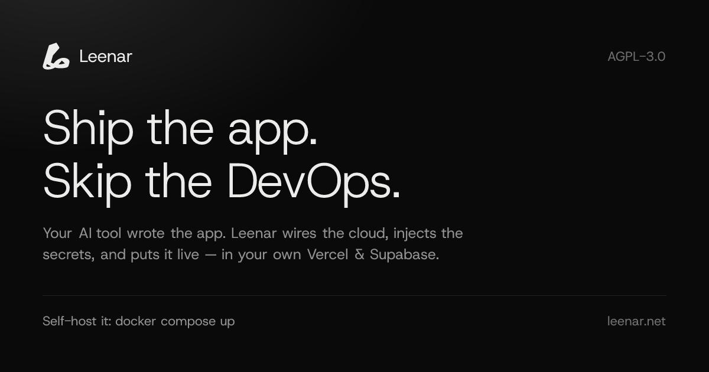
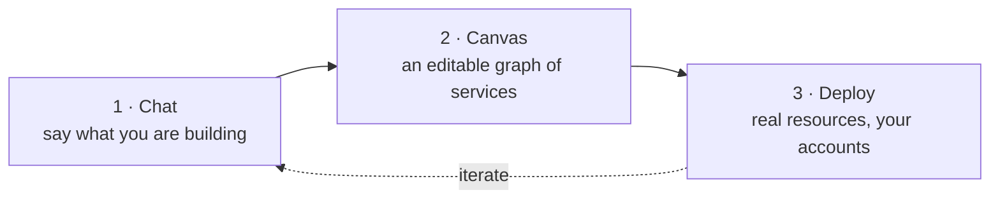
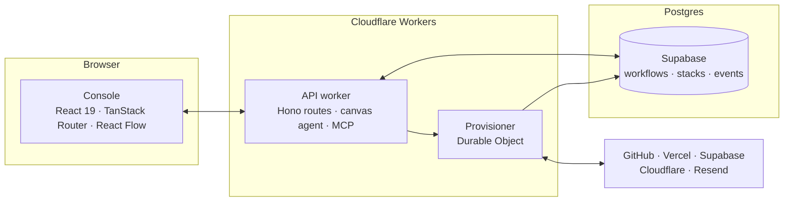

<div align="center">

<a href="https://leenar.net">
  
</a>

### Describe your infrastructure. Watch it become a canvas. Deploy it for real.

Leenar turns a chat message into a live graph of cloud services — a GitHub repo, a
Vercel project, a Supabase database, Cloudflare DNS, a Resend domain — wires the
environment variables between them, and provisions the whole thing in **your own**
cloud accounts. Not a diagram tool: the deploy button creates real resources.

<p>
  <a href="https://leenar.net"></a>
  <a href="./LICENSE"></a>
  <a href="https://github.com/leenarhq/leenar/actions/workflows/ci.yml"></a>
  <a href="./SELF-HOST.md"></a>
  <a href="./CONTRIBUTING.md"></a>
</p>

<a href="#quick-start"><b>Quick start</b></a> ·
<a href="#core-vs-leenar-cloud"><b>Core vs Cloud</b></a> ·
<a href="./SELF-HOST.md"><b>Self-hosting guide</b></a> ·
<a href="#architecture"><b>Architecture</b></a> ·
<a href="./CONTRIBUTING.md"><b>Contributing</b></a>

</div>

---

## How it works



Ask for *"a Next.js app on Vercel with a Postgres database and transactional
email"*. The AI answers with nodes and edges instead of prose: a GitHub node, a
Vercel node, a Supabase node, and the edges that carry credentials between them.
Drag, rename, delete, add — the canvas is yours, the AI just seeds it. Then hit
**Deploy** and the provisioner creates the repo, imports it into Vercel,
spins up the database, injects every environment variable in the right
direction, and streams the log back to you.

## Quick start

The fastest path is Docker — no Supabase project, no OAuth apps, no Cloudflare
account. Just Docker and an OpenAI API key:

```bash
git clone https://github.com/leenarhq/leenar.git && cd leenar
bash docker/setup.sh    # writes .env, generates local secrets, prints your admin login
$EDITOR .env            # set OPENAI_API_KEY=sk-...
docker compose up       # add -d to run in the background
```

Open <http://localhost:8080>, sign in with the credentials `setup.sh` printed,
and start chatting. The bundled stack runs the web console, the API worker
(on [workerd](https://github.com/cloudflare/workerd), the same runtime
Cloudflare Workers use in production), and a self-hosted Supabase subset —
Postgres, Auth, PostgREST and Realtime behind Kong.

To deploy something for real, paste a Personal Access Token for each provider
under **Settings → Integrations**. To drive the canvas from Claude Code or
Cursor instead, create a token under **Settings → API Tokens** — the reveal
screen prints the `claude mcp add` line for your own server, already filled in.
[SELF-HOST.md](./SELF-HOST.md) has the full
walkthrough, a smoke-test checklist, and the production-hardening notes you
must read before exposing this beyond `localhost`.

## Features

|  | |
| --- | --- |
| **Chat → canvas** | An LLM that emits graph mutations, not paragraphs. Every suggestion lands as a node or edge you can edit. |
| **Real provisioning** | GitHub, Vercel, Supabase, Cloudflare and Resend, driven by a Durable Object that survives restarts and rolls back on failure. |
| **Edge-gated env vars** | Connect two nodes and the credentials flow along that edge — framework-aware, so `NEXT_PUBLIC_`/`VITE_`/`PUBLIC_` prefixes land correctly. No edge, no injection. |
| **Database workspace** | Introspect a live Supabase schema, edit tables and RLS policies, toggle extensions, run SQL — against the real database, not a cached copy. |
| **Environments** | Branch a stack off its trunk and promote it back, instead of hand-copying variables between staging and production. |
| **Canvas agent** | Ask for a change in plain language and the AI edits the graph in place — adds a service, wires an edge, renames a node — with every tool call scoped to the canvas in front of you. |
| **MCP server** | The same canvas tools over MCP, so Claude Code, Cursor or any MCP client can read and edit a workspace. One `claude mcp add` line, printed with your API token. |
| **Own your keys** | Bring your own OpenAI key and your own provider tokens. Nothing is proxied through us, and there are no usage caps. |

## Core vs Leenar Cloud

This repository is the **open-source core**: the entire interactive
build-and-deploy loop, self-hostable, under AGPL-3.0-only.
[**Leenar Cloud**](https://leenar.net) is the hosted product, and what it adds
is *autonomy* — the AI DevOps engineer that keeps working while you sleep.

| | Core (this repo) | Leenar Cloud |
| --- | :---: | :---: |
| Chat → canvas → deploy | ✅ | ✅ |
| GitHub · Vercel · Supabase · Cloudflare · Resend | ✅ | ✅ |
| Database workspace (introspect, SQL, schema, RLS) | ✅ | ✅ |
| Environments, API keys, webhooks | ✅ | ✅ |
| Canvas agent (AI edits the graph in place) | ✅ | ✅ |
| MCP server (Claude Code, Cursor, …) | canvas tools | canvas + DevOps tools |
| Self-host with `docker compose up` | ✅ | — |
| Bring your own OpenAI key, no usage caps | ✅ | managed |
| Connecting providers | pasted tokens | OAuth |
| 24/7 incident monitoring and AI diagnosis | — | ✅ |
| Drift detection and auto-reconcile | — | ✅ |
| Autopilot: approved changes applied unattended | — | ✅ |
| Cost and observability insight | — | ✅ |
| Slack and WhatsApp channels | — | ✅ |

## Architecture



One long-lived Durable Object per provisioning run owns the state machine:
step, retry, rollback. The worker stays stateless, the console polls, and every
transition is written to Postgres as an event — so a closed browser tab or a
restarted worker never loses a half-finished deploy.

```
apps/web/        console — chat, canvas, database workspace, settings
workers/api/     API worker (Hono) + the provisioner Durable Object
supabase/        schema migrations
docker/          the self-host bundle
```

**Stack:** React 19 · TanStack Router/Start · React Flow · Tailwind + shadcn/ui ·
Cloudflare Workers & Durable Objects · Hono · Supabase (Postgres, Auth, RLS) ·
OpenAI · Vitest.

## Local development

Without Docker, running from source needs your own Supabase project (apply
`supabase/migrations` to it) and worker secrets set by hand — see the `Env`
interface in `workers/api/src/types.ts` for the full list.

```bash
npm install
cd workers/api && npx wrangler dev   # API worker on :8787
cd apps/web    && npm run dev        # console on :5173
```

The console needs to know where that API worker is, and it is a build-time
value — put it in `apps/web/.env.local` before `npm run dev`:

```
VITE_API_URL=http://localhost:8787
VITE_SUPABASE_URL=https://<your-project-ref>.supabase.co
VITE_SUPABASE_ANON_KEY=<your anon key>
VITE_LEENAR_CLOUD=false
```

If you move the API off `:8787`, change `vars.API_URL` in
`apps/web/wrangler.jsonc` to match. The edge worker copies it into the CSP
`connect-src`, so a stale value gets every API call blocked inside the browser
— the request never reaches the network, and nothing shows up in any log.

## Contributing

Pull requests are welcome and are merged **here**. Sign the
[CLA](./CLA.md) (a bot asks on your first PR), keep changes inside the
interactive-core scope, and run the checks CI runs:

```bash
npm ci
cd apps/web    && npm run lint && npx tsc --noEmit && npm test && npm run build
cd workers/api && npx tsc --noEmit && npm test
```

See [CONTRIBUTING.md](./CONTRIBUTING.md) for the details, and
[SECURITY.md](./SECURITY.md) before reporting a vulnerability — please email
social@leenar.net rather than opening a public issue.

### How this repository works

Leenar Core is developed upstream in a private monorepo alongside Leenar Cloud,
and this repository is synced from it automatically whenever that monorepo's
`main` moves. Every commit on `main` here was produced by that sync and names
the upstream change it carries. Merged pull requests are back-ported upstream by
a maintainer; the sync pauses rather than publishing over your commit, so a
contribution is never silently reverted.

## License

[AGPL-3.0-only](./LICENSE). Network use counts as distribution: if you run a
modified Leenar and other people can reach it, those modifications must be
published under the same license.
